<h1 align="center">
  
   
  CPC Online Judge
</h1>

A DMOJ fork for programming practice and ICPC-style contests.

  
  <a href="docs/setup-guide.md">Installation</a> ·
  <a href="docs/fork-overview.md">Features</a> ·
  <a href="#django-52">Django 5.2</a> ·
  <a href="#security">Security</a> ·
  <a href="docs/contest-tools.md">Contest guide</a> ·
  <a href="MODIFICATIONS.md">Changelog</a>

Run individual or team contests with frozen scoreboards, an interactive reveal
ceremony, balloon delivery tools and a Spanish interface. This fork is maintained
by **CPC-UAEH** and builds on [DMOJ](https://github.com/DMOJ/online-judge), with
additional contest, administration and deployment features.

**Get started:** follow the [installation guide](docs/setup-guide.md) to configure
your own instance. DMOJ provides problem statements in Markdown and LaTeX, live
submission results, multiple contest formats, virtual participation and support
for many programming languages through the
[judge server](https://github.com/DMOJ/judge-server).

## Django 5.2

This fork includes the upgrade to **Django 5.2.17**, pinned in
[`requirements.txt`](requirements.txt), with compatibility changes for timezone
handling, storage configuration, static-file compression and contest
administration. The upgrade also updates the tested django-mptt and
django-compressor dependencies.

The [upgrade guide](docs/django52/README.md) covers the adaptations, settings,
recorded compatibility tests and deployment checks. The
[setup guide](docs/setup-guide.md) explains how to configure a new instance.

## Security

### Application protections

- **Protected owner accounts:** owner-only deletion and sensitive account
  administration, including protection from changes by other superusers.
- **Restricted impersonation:** superuser-only access, protected superuser
  accounts and audit logging.
- **Private custom tests:** signed ownership checks, read-only result polling
  and exclusion from public histories, APIs and statistics.
- **Abuse controls:** configurable admission and rate checks for custom tests,
  plus rate and length limits for contestant clarification requests.
- **Controlled deletion:** explicit confirmations list the records affected by
  permanent team or contest deletion; submission records are preserved.

### Deployment controls

The [deployment examples](deploy/examples/README.md) and
[security guides](docs/security/README.md) provide configuration for:

- separate unprivileged service accounts, systemd isolation and read-only code;
- authenticated Redis and private service listeners;
- secure session and CSRF cookies, edge HSTS, a structural Content Security
  Policy and referrer policy;
- request-size limits, disabled directory listings and a private event-publishing
  endpoint;
- protected configuration and backups, and scheduled cleanup of finished custom
  tests.

Application protections are included in the source; deployment controls must be
configured for each installation. The [security maintenance record](docs/security/README.md)
documents verification scope and known limitations.

## Contests

*The screenshots below show this fork's interface with fictional demo accounts,
teams, contests and results. They do not represent a real competition.*

### Frozen scoreboards

Configure a freeze window and keep results hidden across the scoreboard,
participation pages, submissions, statistics, API and live updates. Organizers
explicitly release the final results.

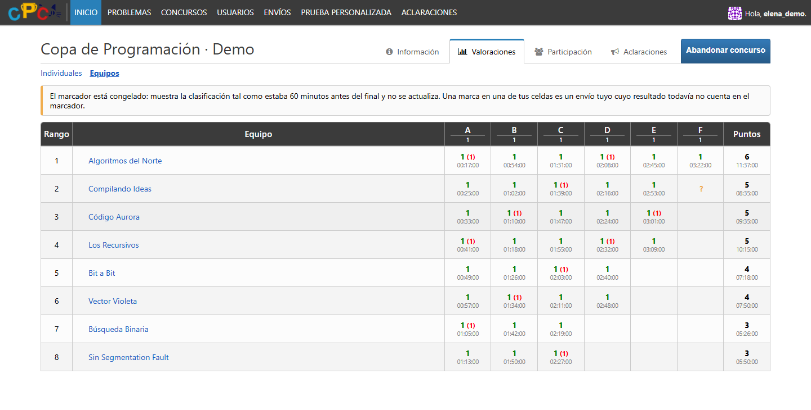

### Reveal ceremony

The reveal ceremony works with **both individual contestants and teams**.
Reveal results in order with adjustable playback speed, medal ranges,
tie handling and first-to-solve awards. Award cards show the individual
contestant or the team and its registered members. In mixed contests, select
the individual or team division to present its standings.

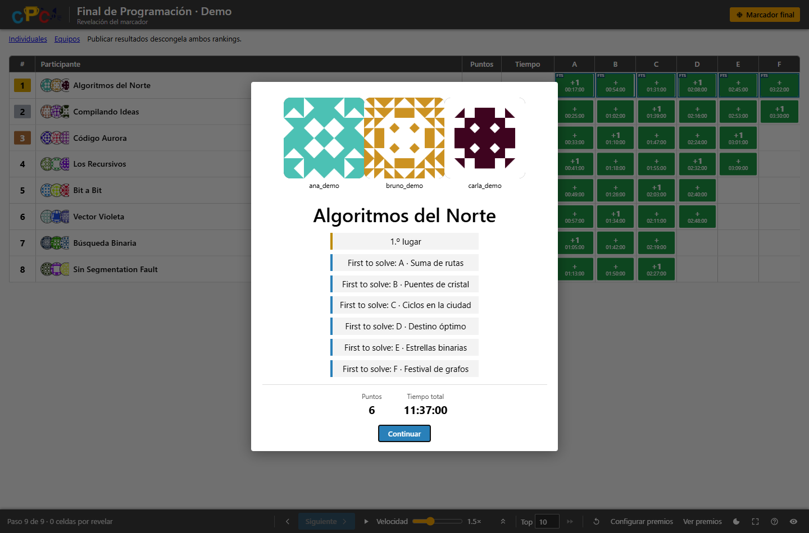

### Balloon delivery

Track pending and delivered balloons, assign problem colors and participant
locations, and undo delivery mistakes. Dedicated staff permissions control access
to the desk; accepted submissions during the freeze remain hidden.

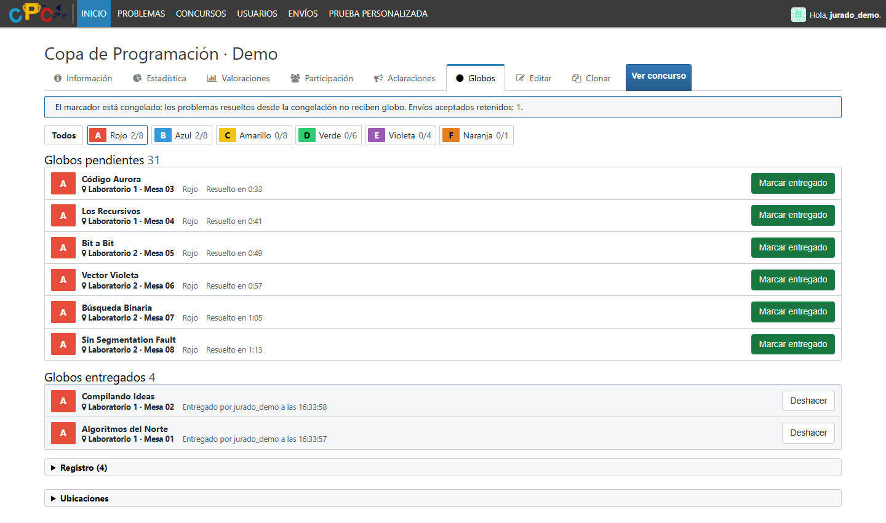

### Announcements and clarifications

Publish announcements for the whole site or one contest. Contestants can ask
about a problem or the contest rules; the jury can answer privately or share an
answer with everyone.

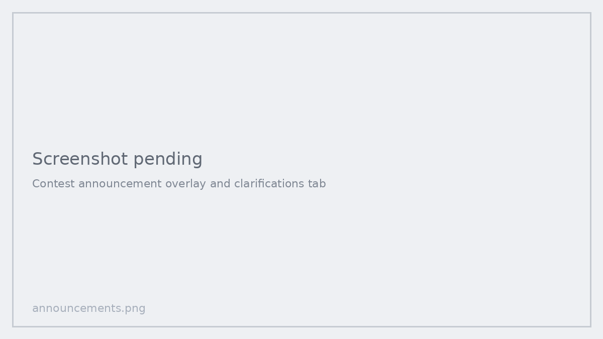

## Teams

### Teams and invitations

Create a team, invite members and manage the roster from **My teams**. Members
submit from their own accounts while sharing the team's contest score and clock.

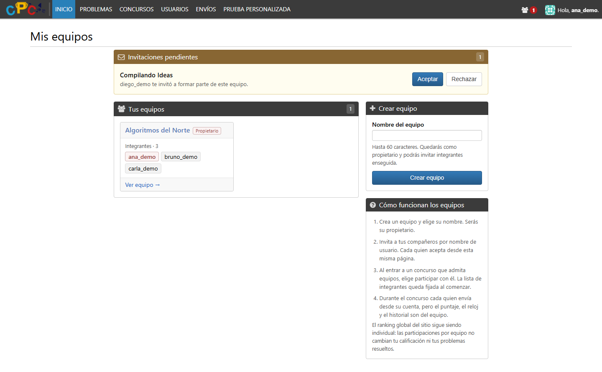

### Contest registration

Choose individual or team participation and select the members who will compete.
One access code registers the selected roster, subject to the contest's team
size and individual eligibility rules.

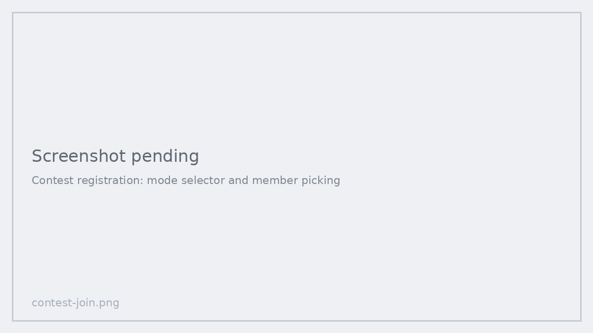

### Separate rankings

Run individual, team or mixed contests. Mixed contests have separate ranking
tabs, and team results stay separate from individual site ratings. Rankings
refresh automatically while the browser tab is visible.

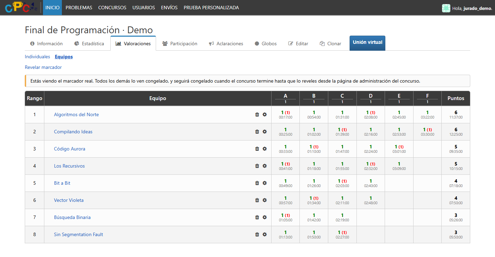

## Interface

### Light and dark themes

Every account can choose a light or dark theme, or follow the system preference.
The fork's screens and navigation include Spanish and English translations.

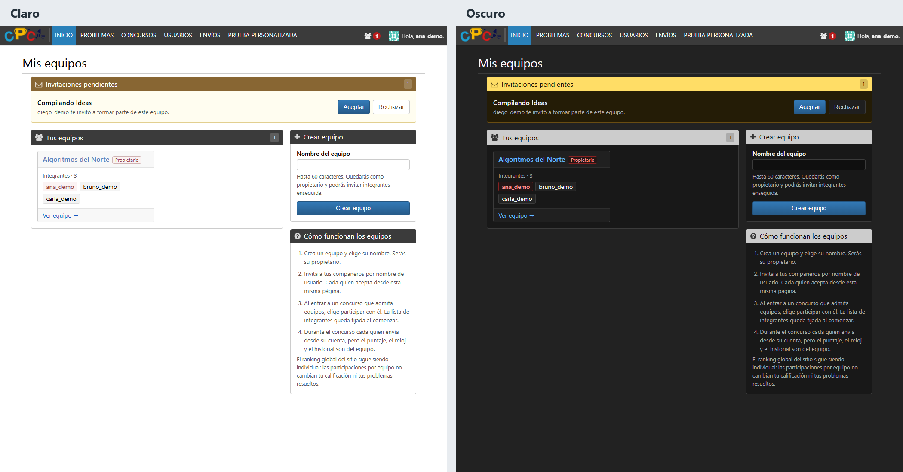

### Custom tests

Try code with your own input in a spacious editor, with translated status
messages and output up to 64 KB by default. Custom tests remain separate from
public submission histories and statistics.

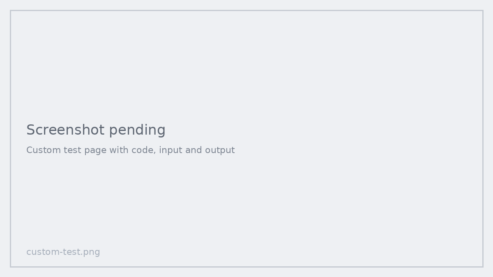

### Test cases from ZIP archives

Populate test cases from paired input and output files. Automatic pairing
supports extensions or folders, natural ordering, batch detection and integer
point distribution, with feedback for unpaired files.

## Administration

Manage teams, invitations, memberships and contest participation from the admin,
with search by team or member.

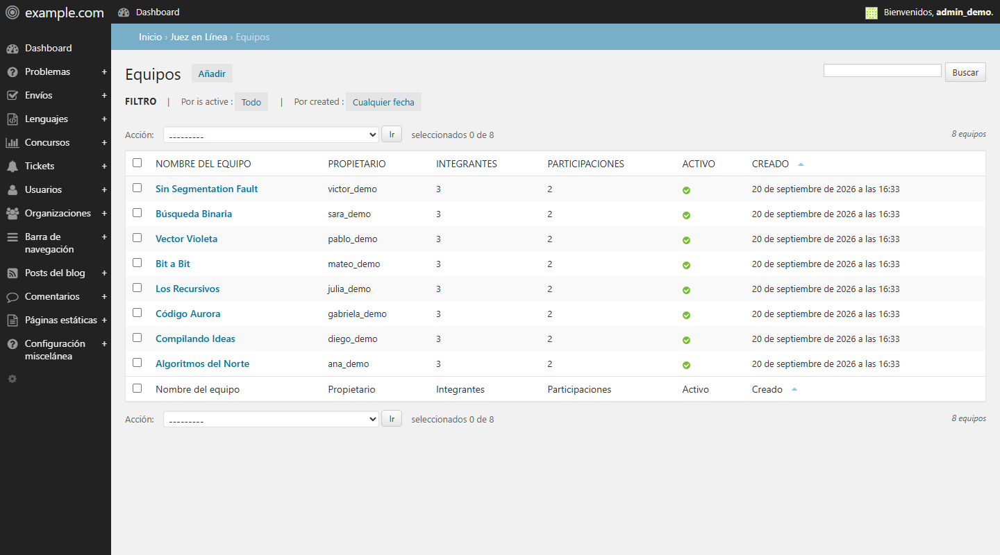

Accounts configured in `CPC_SERVER_OWNERS` control deletion and sensitive account
administration. Other superusers cannot edit those accounts or grant the protected
privileges. Permanent team and contest deletion requires a confirmation that
lists the affected records; submission records are preserved.

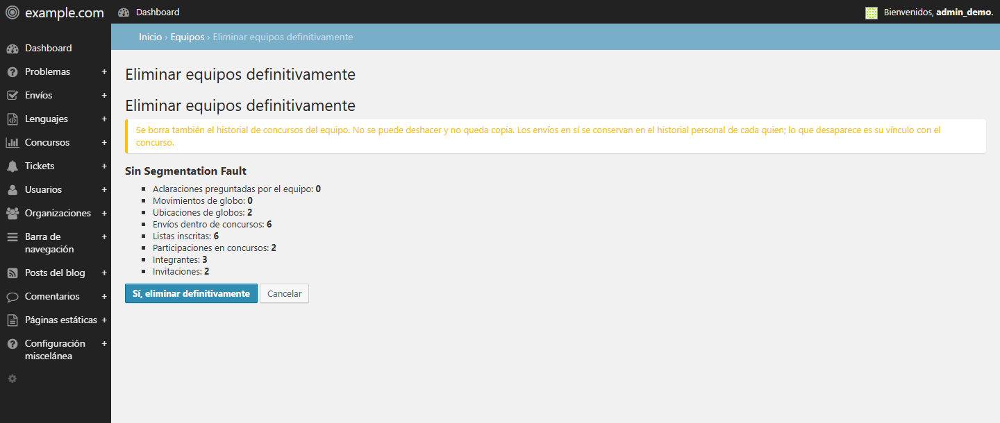

## Installation and documentation

Start with a working [DMOJ installation](https://docs.dmoj.ca/#/site/installation),
then follow [Setting up this fork](docs/setup-guide.md) for settings, migrations,
translations, static assets, service configuration and scheduled cleanup.

| Guide | Contents |
| --- | --- |
| [Setup guide](docs/setup-guide.md) | Installation, configuration and verification |
| [Fork overview](docs/fork-overview.md) | Features and changes relative to upstream |
| [Django 5.2 upgrade](docs/django52/README.md) | Compatibility changes, tested dependencies and upgrade guidance |
| [Contest tools](docs/contest-tools.md) | Freeze, reveal and balloon workflows |
| [Deployment examples](deploy/examples/README.md) | Example service units, Nginx settings and maintenance tasks |
| [Security maintenance](docs/security/README.md) | Controls, verification scope and known limitations |
| [Screenshot gallery](docs/screenshots/README.md) | Full-size demonstration images |

## Upstream and license

Based on DMOJ commit `97f3722ef3f7ca9731727c220622bdd1eab7d4b3`.
Distributed under the [GNU Affero General Public License v3](LICENSE).
See [MODIFICATIONS.md](MODIFICATIONS.md) for the fork's changes and attribution.

Production credentials, user data, problem packages, uploaded media, logs and
generated static files are excluded from this repository.

Upstream resources: [DMOJ](https://github.com/DMOJ/online-judge) ·
[Documentation](https://docs.dmoj.ca/) ·
[Judge server](https://github.com/DMOJ/judge-server) ·
[Community](https://dmoj.ca/about/discord/).
