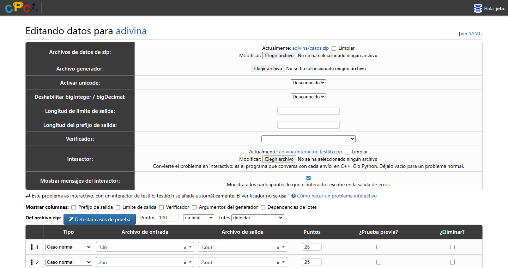
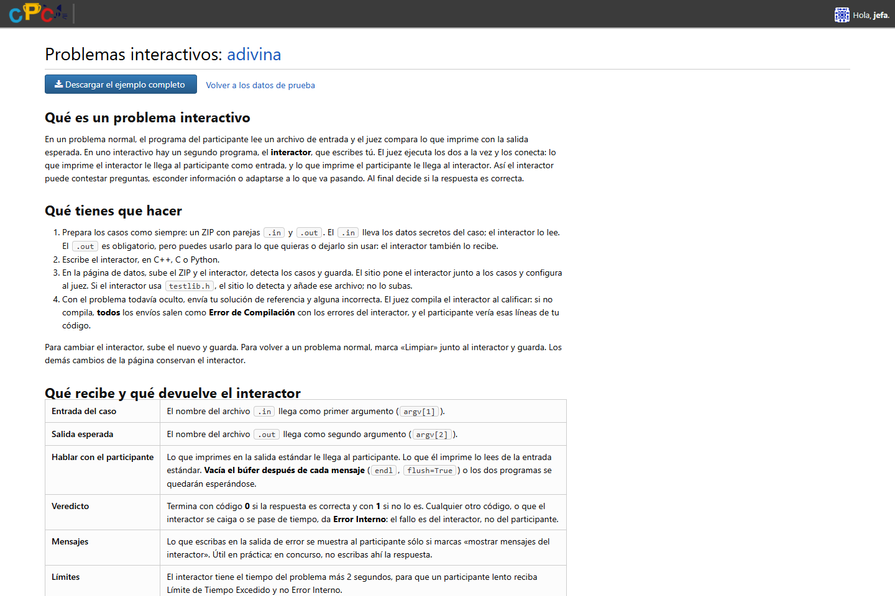

# Interactive problems

In an interactive problem the judge runs a second program, the **interactor**,
next to each submission and connects them: what the interactor prints is the
contestant's input, and what the contestant prints is the interactor's input.
The interactor decides the verdict.

The DMOJ judge has supported this for a long time through an `interactive:`
block in a problem's `init.yml`, but upstream's problem data page cannot produce
that block, and saving the page rewrites `init.yml` without it. This fork adds
the missing piece to the page, so problem setters never touch the server.



## What the fork adds

- An **Interactor** field on the problem data page, next to the data archive and
  the generator. It accepts `.cpp`, `.cc`, `.c` and `.py` sources up to 1 MB and
  stores the file in the problem's data directory, where the judge looks for it.
- A **Show interactor messages** checkbox, off by default. When it is on,
  whatever the interactor writes to standard error is shown to contestants as
  case feedback.
- The page writes the `interactive:` block **every time it is saved**, so later
  edits to cases, points or the archive keep the problem interactive.
- **testlib detection.** If the interactor has `#include "testlib.h"`, the page
  uses the judge's testlib mode and copies a bundled `testlib.h` next to it.
  Problem setters do not upload the header. A byte order mark and Windows line
  endings are tolerated.
- A notice under the form saying whether the problem is interactive, whether it
  uses testlib, or whether the interactor file has gone missing from disk.
- A **guide** for problem setters at `/problem/<code>/test_data/interactive`,
  linked from the data page and visible only to people who can edit the problem.
  It includes a complete worked example (a number-guessing game with a plain
  interactor, a Python one, a testlib one, reference solutions, cases and a
  sample statement) and a button that downloads it as a zip. **The guide and the
  example are written in Spanish**, the language of the fork's users.



The same change fixes an upstream bug on this page: **uploading a data archive
over an existing one lost both**. The old file was deleted with
`FieldFile.delete`, which also clears the field on the instance being saved, so
the new archive was never stored and the problem was left with cases but no
`archive:`. Old files are now removed by name, after the new ones are saved.

## What the page writes

For `interactor.cpp` with the checkbox off, `init.yml` gets:

```yaml
interactive:
  feedback: false
  files:
  - interactor.cpp
```

A testlib interactor adds `type: testlib` and `testlib.h` to `files`. A Python
interactor adds `lang: PY3`, because otherwise the judge may pick a Python 2
executor by extension. C and C++ are left to the judge, which compiles helper
programs with the newest C or C++ executor it has loaded.

The checker selected on the page is ignored for interactive problems; the
interactor decides.

## Judge requirements

- A judge with interactive grading. It was tested with `dmoj` 4.1.0.
- The executors the interactors need must be loaded on every judge: a C++
  executor (`CPP20`, `CPP17`, …) for `.cpp` and `.cc`, `C11` or `C` for `.c`, and
  `PY3` for `.py`. If you restrict executors with `-e`, keep one of each kind you
  want to allow.
- The judge reads the interactor from the problem directory, like the data
  archive. The web service writes it with the same owner and mode as the
  archives, so no permission change is needed.

## The interactor contract

| | Plain interactor | testlib interactor |
| --- | --- | --- |
| Arguments | `input_file answer_file` | `input_file output_file answer_file`; `output_file` is `/dev/null` |
| Accepted | exit code 0 | `quitf(_ok, …)` |
| Wrong answer | exit code 1 | `quitf(_wa, …)`; `_pe` also counts as wrong |
| Anything else | internal error | `_fail` is an internal error |

`input_file` is the case's `.in` and `answer_file` its `.out`. The data page
requires an `.out` for every case, but the interactor may ignore it.

The interactor gets the problem's time limit plus two seconds, so a slow
contestant is reported as a time limit and not as an internal error.

## Verdicts worth knowing about

These are judge behaviours, measured with `dmoj` 4.1.0. The in-site guide
explains them to problem setters.

- **An interactor that does not compile** makes every submission a
  **compilation error**, and the message quotes lines of the interactor.
  Contestants can see it, so test new interactors while the problem is hidden.
- **An interactor that crashes, times out or exits with another code** is an
  internal error.
- **A contestant who does not flush** after each line gets a time limit: both
  programs wait for each other. `unbuffered: true` does not help. In C++, `cin`
  flushes `cout` unless it was untied with `cin.tie(nullptr)`; in Python,
  `input()` flushes standard output first.
- **A contestant who keeps going after being rejected** gets a different verdict
  depending on the language. In Python, `input()` raises `EOFError`: invalid
  return or runtime error. In C++, `cin` fails silently and the loop goes on:
  wrong answer if it ends soon, time limit if not. The example prints `-1` before
  rejecting and its statement asks programs to stop when they read it.
- **Custom tests do not use the interactor.** They run the program with the
  input typed by the user.

## Upgrading an existing installation

1. Back up the database.
2. Apply migration `0156_problemdata_interactor`. It adds two columns to
   `judge_problemdata`: a nullable file name and a boolean with a database
   default of false. No existing row or column is rewritten.
3. Compile the catalogs: `manage.py compilemessages -l es -l en`.
4. Reload the web service. Celery, the bridge and the event daemon do not use
   this code.

The changed templates contain no `` block and `base.html` is
untouched, so an existing offline compression manifest stays valid.

**Rolling back the code alone is safe for the database.** Code without the new
fields ignores the columns, and the boolean's database default covers its
inserts. But with the old code, saving the data page of an interactive problem
rewrites `init.yml` without the `interactive:` block again, and the problem is
then graded as a normal one.

## Third-party code

`judge/utils/interactive/testlib.h` is [testlib](https://github.com/MikeMirzayanov/testlib)
0.9.45 by Mike Mirzayanov, from upstream commit
`2d20123984e9479b8a56ebe0d6a51e23ad7c35b3`, distributed under the MIT License. The
license text is next to it in `testlib-LICENSE.txt`. To update it, replace both
files. Existing problems pick up the new header the next time their data page is
saved.

## Tests

[`tests/interactive_problems`](../tests/interactive_problems/README.md) runs 23
Django tests in an isolated copy with an in-memory database. They cover the
generated `init.yml`, testlib detection, validation, later saves, replacing and
clearing files, renaming a problem, archive replacement and page access.
